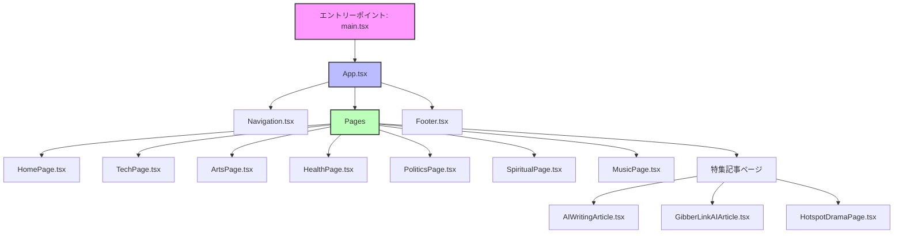
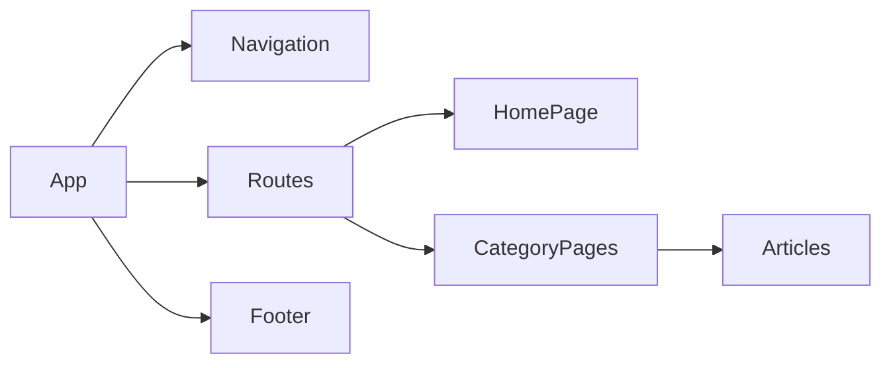

# 🌊 News Site Coral 🌊

テクノロジー、スピリチュアル、健康、アート、政治など多様なトピックスを扱うモダンなニュース・マガジンサイト


## 📊 プロジェクト概要

News Site Coralは、多様なトピックスを扱う次世代のニュースプラットフォームです。最新のWeb技術を活用し、ユーザーに洗練されたニュース体験を提供します。

## 🛠️ 技術スタック

| 技術 | 用途 | バージョン |
|------|------|----------|
| React | UIフレームワーク | 18.x |
| TypeScript | 型付け言語 | 5.x |
| Vite | ビルドツール | 5.x |
| Emotion | スタイリング | 11.x |
| Framer Motion | アニメーション | 10.x |
| React Router | ルーティング | 6.x |

## 🚀 開発環境のセットアップ

```bash
# 依存パッケージのインストール
npm install

# 開発サーバーの起動
npm run dev
```

## 📝 ESLint設定

プロダクション用にTypeScript対応のESLint設定を有効にする場合:

```js
export default tseslint.config({
  languageOptions: {
    parserOptions: {
      project: ['./tsconfig.node.json', './tsconfig.app.json'],
      tsconfigRootDir: import.meta.dirname,
    },
  },
})
```

## 🗂️ プロジェクト構造

```
src/
  ├── components/     # 再利用可能なコンポーネント
  ├── pages/         # ページコンポーネント
  │   └── articles/  # 記事ページ
  ├── styles/        # グローバルスタイル
  ├── assets/        # 静的アセット
  ├── App.tsx        # メインアプリケーション
  └── main.tsx       # エントリーポイント
```

## 📊 アプリケーションフロー



## 📱 ページコンポーネント階層



## 📅 プロジェクトロードマップ

| フェーズ | 機能 | ステータス |
|---------|------|----------|
| Phase 1 | 基本UI構築 | ✅ |
| Phase 2 | 記事ページ実装 | ✅ |
| Phase 3 | CMS連携 | 🔄 |
| Phase 4 | ユーザー認証 | 📅 |
| Phase 5 | パーソナライズ機能 | 📅 |

## 🌐 コンテンツカテゴリ

- 🖥️ テクノロジー
- 🧘 スピリチュアル
- ❤️ 健康
- 🎨 アート
- 🏛️ 政治
- 🎵 音楽

## 📚 関連ドキュメント

- [Strapi CMS セットアップ](/docs/strapi-setup.md)
- [フロントエンドとCMSの連携](/docs/frontend-cms-integration.md)
- [コンテンツ管理ガイド](/docs/content-management.md)

## 👥 コントリビューション

プルリクエストは大歓迎です。大きな変更を加える場合は、まずissueを作成して議論してください。

## 📜 ライセンス

[MIT](https://choosealicense.com/licenses/mit/)
